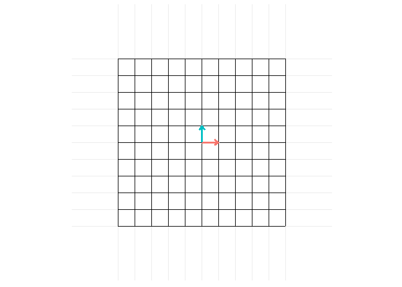
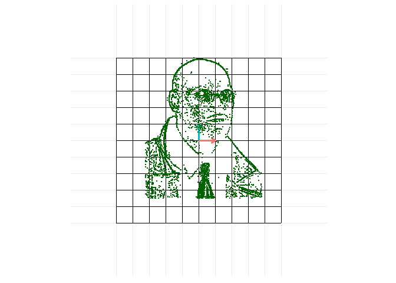

<!-- README.md is generated from README.Rmd. Please edit that file -->

# animatrixr

`animatrixr` is a *toy* package that allows you to pipe together
animations of matrix transformations. For example:

(rotate) –\> (sheer) –\> (reflect) –\> *ANIMATE*

``` r
library(dplyr)
library(animatrixr)

rotate_90 <- animatrixr::rotation_matrix(pi/2)

sheer_vertical <- tribble( ~ x, ~ y,
                           1, 0,
                           0.5, 1) %>%
  as.matrix()

reflect_x <- tribble( ~ x, ~ y,
                      1, 0,
                      0,-1) %>%
  as.matrix() 

example_transformations <-
  add_transformation(m = rotate_90, seq_fun = animatrixr::seq_matrix_lp) %>%
  add_transformation(m = sheer_vertical) %>%
  add_transformation(m = reflect_x)

animate_matrix(example_transformations)
```



You can use `seq_fun` argument to specify the function used to
explicitly define the frames in-between the start and end of an
animation of a matrix transformation.

# Adding coordinates

You can use the `points_start` argument to graph coordinates on the
animation.

``` r
animate_matrix(example_transformations,
               points_start = animatrixr::morpheus)
#> x, y coordinates of `points_start` scaled so that maximum magnitude is 5.
```



Setting `datasaurus = TRUE` is a way to add the
[datasarus](https://github.com/lockedata/datasauRus) to the animation
and is equivalent to setting `points_start =
filter(datasauRus::datasaurus_dozen, dataset == "dino")`.

# Use at your own risk + limitations

`animatrixr` is a *toy* package I wrote (hastily) to support a [blog
post](https://www.bryanshalloway.com/2020/02/24/animatrixr-visualizing-matrix-transformations-pt-2/)
on exploring animating matrix transformations using `gganimate`. The
blog post doubles as providing documentation on how `animatrixr` is
set-up and some of its limitations. I had also written an initial [blog
post](https://www.bryanshalloway.com/2020/02/20/visualizing-matrix-transformations-with-gganimate/)
the week prior on animating matrix transformations that contains further
documentation on some of the functions that ultimately wound-up in
`animatrixr`.

The matrix multiplications create *tiny* rounding errors that make
reading the matrices when printing more difficult. To clean these up you
can simply round the values , e.g. by doing
`purrr::modify(example_transformations, round, 10)`.

Almost no work has gone into setting-up tests, catching errors,
considering potential users, etc. Also, many visualizations you might
try to make may look unintuitive (or simply come-out incorrect) –
especially involving rotations when starting outside of unit vectors.

## Installation

If you *still* want to check-it out, you can install it from my github
page:

``` r
devtools::install_github("brshallo/animatrixr")
```
